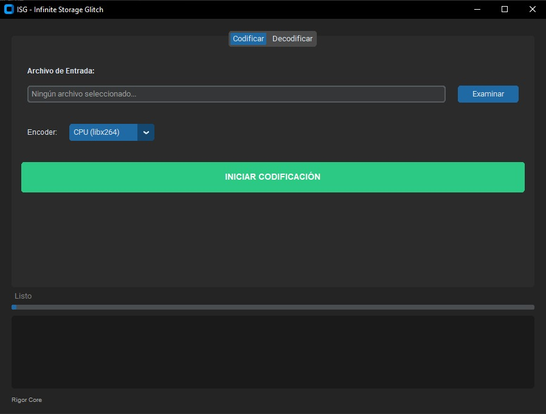

# ♾️ Infinite Storage Glitch (ISG)




## Topics

`python` · `steganography` · `video-encoding` · `data-storage` · `ffmpeg` · `customtkinter` · `numpy` · `gpu-acceleration` · `file-recovery` · `binary-encoding`

---

## 🧠 ¿Cómo funciona?

### ⬛⬜ Escala de Grises
Los bits del archivo se representan como píxeles blancos (`0`) y negros (`1`). Se usa escala de grises porque la compresión de video preserva mejor la luminancia que la crominancia.

### 🧱 Macro-Píxeles 4×4
Cada bit ocupa un bloque de **4×4 píxeles** para crear redundancia ante la compresión de video. El decodificador muestrea el centro de cada bloque, donde la información se preserva mejor.

### 🏷️ Cabecera ISG2
Cada video incluye una cabecera oculta con metadatos del archivo original:
```
[MAGIC "ISG2"] + [Largo Header] + [JSON {filename, size}]
```

### ⚡ Aceleración GPU
Soporte para codificación acelerada por hardware:
- **NVIDIA** → `h264_nvenc`
- **AMD** → `h264_amf`
- **Intel** → `h264_qsv`
- **CPU** → `libx264`

---

## 🛠️ Requisitos e Instalación

Necesitas **Python 3.8+** y **FFmpeg** instalados.

1. **Instalar dependencias de Python**:
   ```bash
   pip install -r requirements.txt
   ```

2. **Instalar FFmpeg**:
   Asegúrate de que `ffmpeg` y `ffprobe` estén en tu variable de entorno PATH.

---

## 🚀 Cómo Usar

```bash
python main.py
```

### 📤 Codificar (Archivo → Video)
1. Ve a la pestaña **"Codificar"**.
2. Selecciona tu archivo con **"Examinar"**.
3. Elige tu encoder (CPU, NVIDIA, AMD, Intel).
4. Pulsa **"INICIAR CODIFICACIÓN"** y guarda el .mp4.

### 📥 Decodificar (Video → Archivo)
1. Ve a la pestaña **"Decodificar"**.
2. Selecciona el video con **"Buscar Video"**.
3. Elige la carpeta de salida.
4. Pulsa **"RECUPERAR ARCHIVOS"**.
5. Tu archivo original aparecerá en la carpeta de salida.

---

## 📁 Estructura del Proyecto

```
infinite-storage-glitch/
├── main.py                    # Punto de entrada
├── requirements.txt           # Dependencias
├── ejemplo.jpg                # Captura de pantalla
├── core/                      # Lógica de negocio
│   ├── __init__.py
│   ├── utils.py               # BaseProcessor y utilidades compartidas
│   ├── encoder.py             # Codificación archivo → video
│   └── decoder.py             # Decodificación video → archivo
└── ui/                        # Interfaz gráfica
    ├── __init__.py
    ├── app.py                 # Ventana principal + watermark
    └── tabs/
        ├── __init__.py
        ├── encode_tab.py      # Pestaña de codificación
        └── decode_tab.py      # Pestaña de decodificación
```

---

*Rigor Core — Infinite Storage Glitch*
